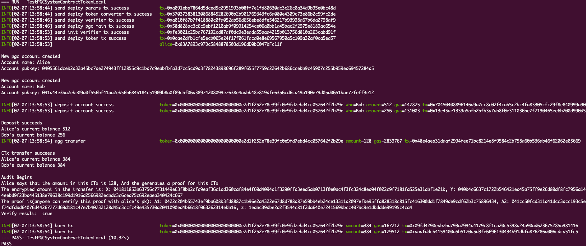

# PGC

PGC(Pretty Good Confidential Transaction System with Accountability)是一种基于账户体现的可监管加密交易系统。普通用户可以使用该系统进行隐私交易转账，拥有`Global Key`的机构可以对所有交易进行监管，同时本系统还提供诸如反洗钱等（线性升级策略）审计功能。

## 部署测试

在测试之前，需要安装`golang`和`ganache`，同时在`.env`中设置好相应的配置，可参照`.env.example`。

`.env`详细配置如下:

- TestMemo: 启动本地链使用的助记词
- DeployerKey: 合约部署者私钥
- AliceKey: 测试用户 alice 私钥
- BobKey: 测试用户 bob 私钥
- GlobalKey: 监管者私钥

启动本地区块链

```bash
ganache -m $your_memo
```

执行测试

```bash
cd test

go test -v -timeout 1h -run="TestPGCSystemContractTokenLocal"
```

执行结果


